# Session 1: Cloud Fundamentals: Slides

Each slide as an image, with its text underneath. See [study-guide.md](study-guide.md) for the full explanation, steps and practice.

---

## Slide 1: Session 1

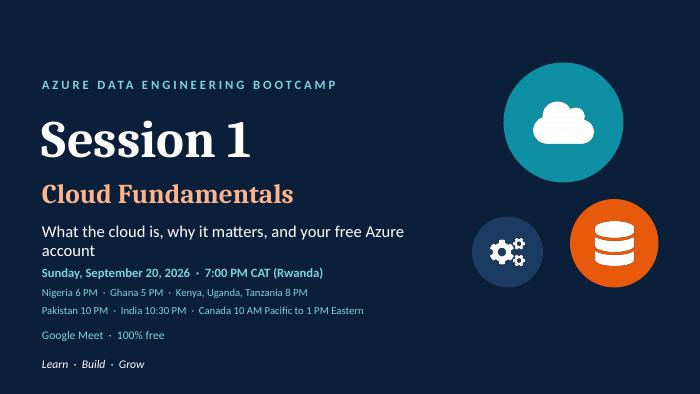

- AZURE DATA ENGINEERING BOOTCAMP
- Cloud Fundamentals
- What the cloud is, why it matters, and your free Azure account
- Sunday, September 20, 2026  ·  7:00 PM CAT (Rwanda)
- Nigeria 6 PM  ·  Ghana 5 PM  ·  Kenya, Uganda, Tanzania 8 PM
- Pakistan 10 PM  ·  India 10:30 PM  ·  Canada 10 AM Pacific to 1 PM Eastern
- Google Meet  ·  100% free
- Learn  ·  Build  ·  Grow

---

## Slide 2: Session agenda

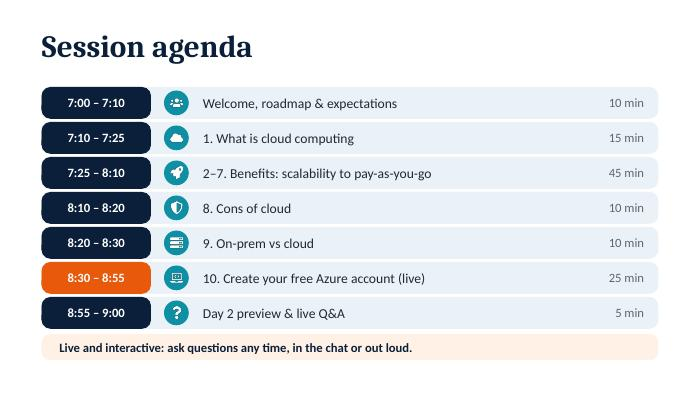

- 7:00 – 7:10 | Welcome, roadmap & expectations | 10 min
- 7:10 – 7:25 | 1. What is cloud computing | 15 min
- 7:25 – 8:10 | 2–7. Benefits: scalability to pay-as-you-go | 45 min
- 8:10 – 8:20 | 8. Cons of cloud | 10 min
- 8:20 – 8:30 | 9. On-prem vs cloud | 10 min
- 8:30 – 8:55 | 10. Create your free Azure account (live) | 25 min
- 8:55 – 9:00 | Day 2 preview & live Q&A | 5 min
- Live and interactive: ask questions any time, in the chat or out loud.

---

## Slide 3: Program at a glance

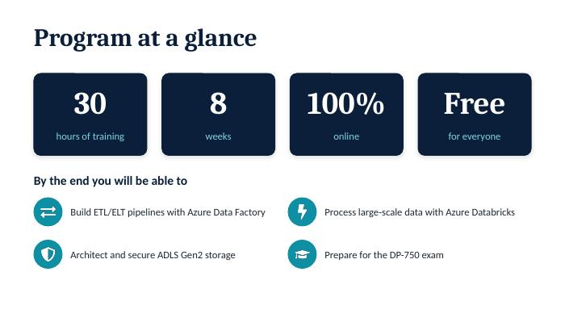

- 30 | 8 | 100% | Free
- hours of training | weeks | online | for everyone
- By the end you will be able to
- Build ETL/ELT pipelines with Azure Data Factory | Process large-scale data with Azure Databricks
- Architect and secure ADLS Gen2 storage | Prepare for the DP-750 exam

---

## Slide 4: 8-week roadmap

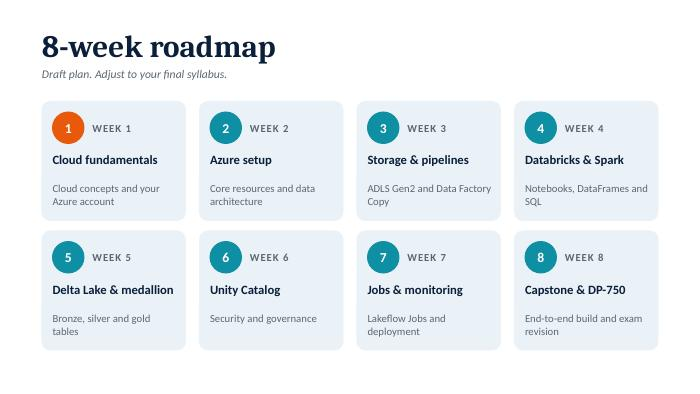

- Draft plan. Adjust to your final syllabus.
1. WEEK 1 — 2 — WEEK 2 — 3 — WEEK 3 — 4 — WEEK 4
- Cloud fundamentals | Azure setup | Storage & pipelines | Databricks & Spark
- Cloud concepts and your Azure account | Core resources and data architecture | ADLS Gen2 and Data Factory Copy | Notebooks, DataFrames and SQL
5. WEEK 5 — 6 — WEEK 6 — 7 — WEEK 7 — 8 — WEEK 8
- Delta Lake & medallion | Unity Catalog | Jobs & monitoring | Capstone & DP-750
- Bronze, silver and gold tables | Security and governance | Lakeflow Jobs and deployment | End-to-end build and exam revision

---

## Slide 5: 1. What is cloud computing?

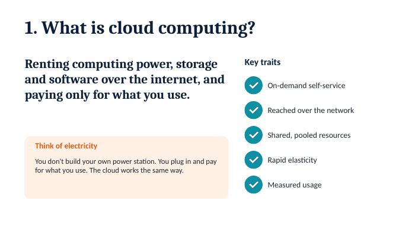

- Renting computing power, storage and software over the internet, and paying only for what you use. | Key traits
- On-demand self-service
- Reached over the network
- Shared, pooled resources
- Think of electricity
- You don't build your own power station. You plug in and pay for what you use. The cloud works the same way. | Rapid elasticity
- Measured usage

---

## Slide 6: Cloud service and deployment models

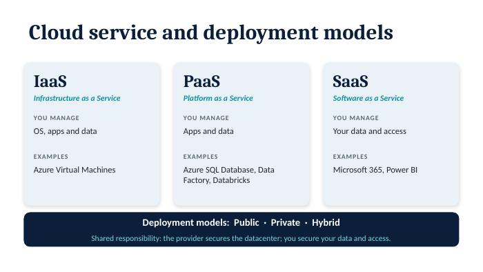

- IaaS | PaaS | SaaS
- Infrastructure as a Service | Platform as a Service | Software as a Service
- YOU MANAGE | YOU MANAGE | YOU MANAGE
- OS, apps and data | Apps and data | Your data and access
- EXAMPLES | EXAMPLES | EXAMPLES
- Azure Virtual Machines | Azure SQL Database, Data Factory, Databricks | Microsoft 365, Power BI
- Deployment models:  Public  ·  Private  ·  Hybrid
- Shared responsibility: the provider secures the datacenter; you secure your data and access.

---

## Slide 7: 2. Why move to the cloud?

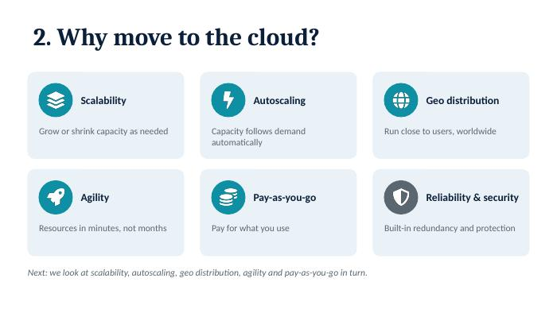

- Scalability | Autoscaling | Geo distribution
- Grow or shrink capacity as needed | Capacity follows demand automatically | Run close to users, worldwide
- Agility | Pay-as-you-go | Reliability & security
- Resources in minutes, not months | Pay for what you use | Built-in redundancy and protection
- Next: we look at scalability, autoscaling, geo distribution, agility and pay-as-you-go in turn.

---

## Slide 8: 3. Scalability

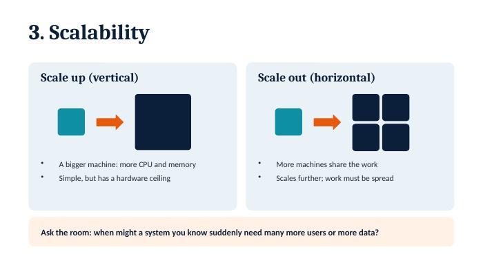

- Scale up (vertical) | Scale out (horizontal)
  - A bigger machine: more CPU and memory
  - Simple, but has a hardware ceiling
  - More machines share the work
  - Scales further; work must be spread
- Ask the room: when might a system you know suddenly need many more users or more data?

---

## Slide 9: 4. Autoscaling

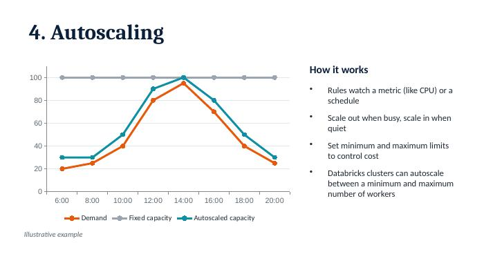

*Chart (illustrative):*

| | 6:00 | 8:00 | 10:00 | 12:00 | 14:00 | 16:00 | 18:00 | 20:00 |
| --- | --- | --- | --- | --- | --- | --- | --- | --- |
| Demand | 20 | 25 | 40 | 80 | 95 | 70 | 40 | 25 |
| Fixed capacity | 100 | 100 | 100 | 100 | 100 | 100 | 100 | 100 |
| Autoscaled capacity | 30 | 30 | 50 | 90 | 100 | 80 | 50 | 30 |

- How it works
  - Rules watch a metric (like CPU) or a schedule
  - Scale out when busy, scale in when quiet
  - Set minimum and maximum limits to control cost
  - Databricks clusters can autoscale between a minimum and maximum number of workers
- Illustrative example

---

## Slide 10: 5. Geo distribution

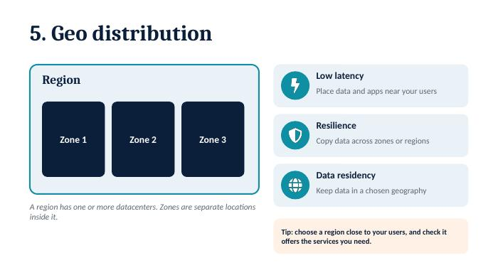

- Region | Low latency
- Place data and apps near your users
- Zone 1 | Zone 2 | Zone 3
- Resilience
- Copy data across zones or regions
- Data residency
- Keep data in a chosen geography
- A region has one or more datacenters. Zones are separate locations inside it.
- Tip: choose a region close to your users, and check it offers the services you need.

---

## Slide 11: 6. Agility

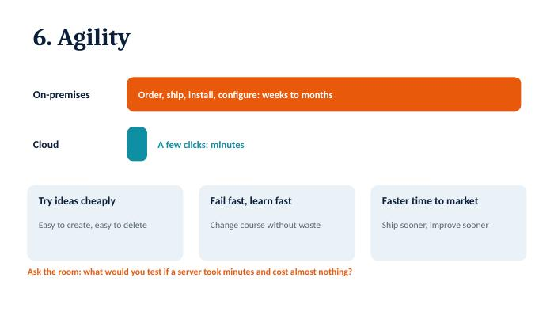

- On-premises | Order, ship, install, configure: weeks to months
- Cloud | A few clicks: minutes
- Try ideas cheaply | Fail fast, learn fast | Faster time to market
- Easy to create, easy to delete | Change course without waste | Ship sooner, improve sooner
- Ask the room: what would you test if a server took minutes and cost almost nothing?

---

## Slide 12: 7. Pay-as-you-go model

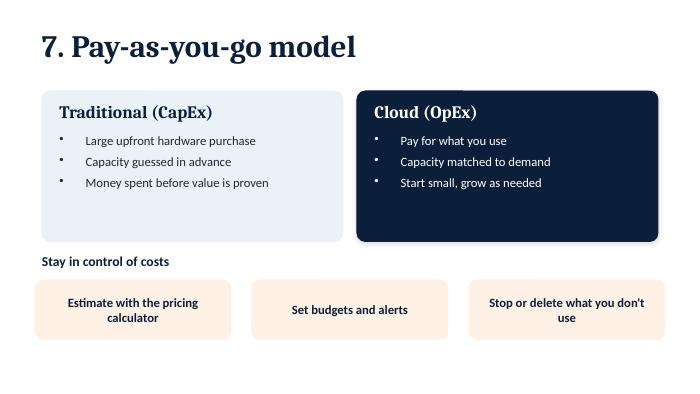

- Traditional (CapEx) | Cloud (OpEx)
  - Large upfront hardware purchase
  - Capacity guessed in advance
  - Money spent before value is proven
  - Pay for what you use
  - Capacity matched to demand
  - Start small, grow as needed
- Stay in control of costs
- Estimate with the pricing calculator | Set budgets and alerts | Stop or delete what you don't use

---

## Slide 13: 8. Cons of cloud

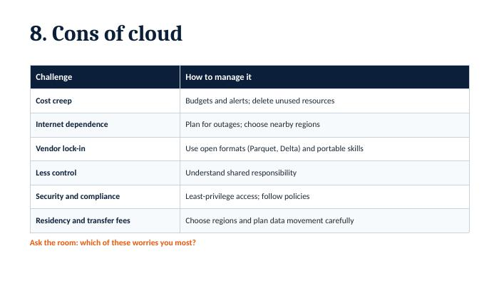

| Challenge | How to manage it |
| --- | --- |
| Cost creep | Budgets and alerts; delete unused resources |
| Internet dependence | Plan for outages; choose nearby regions |
| Vendor lock-in | Use open formats (Parquet, Delta) and portable skills |
| Less control | Understand shared responsibility |
| Security and compliance | Least-privilege access; follow policies |
| Residency and transfer fees | Choose regions and plan data movement carefully |

- Ask the room: which of these worries you most?

---

## Slide 14: 9. On-prem vs cloud

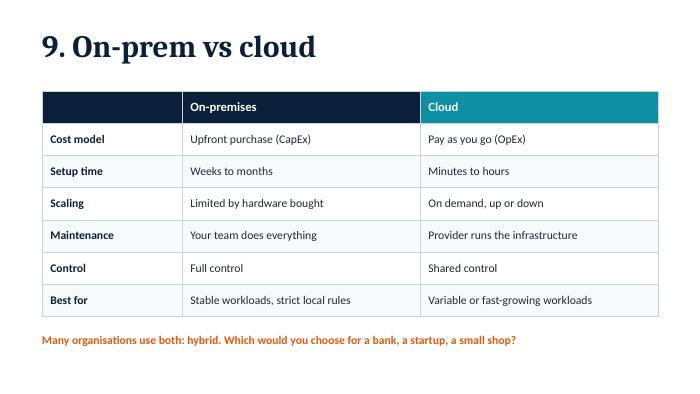

|   | On-premises | Cloud |
| --- | --- | --- |
| Cost model | Upfront purchase (CapEx) | Pay as you go (OpEx) |
| Setup time | Weeks to months | Minutes to hours |
| Scaling | Limited by hardware bought | On demand, up or down |
| Maintenance | Your team does everything | Provider runs the infrastructure |
| Control | Full control | Shared control |
| Best for | Stable workloads, strict local rules | Variable or fast-growing workloads |

- Many organisations use both: hybrid. Which would you choose for a bank, a startup, a small shop?

---

## Slide 15: 10. Create your free Azure account

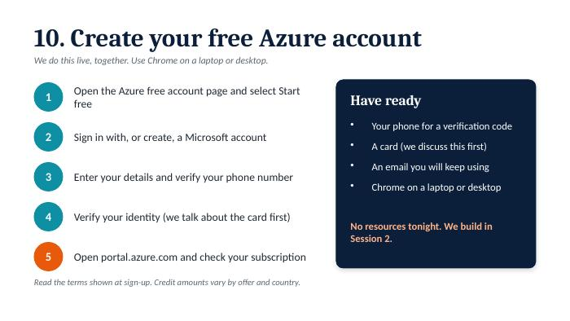

- We do this live, together. Use Chrome on a laptop or desktop.
1. Open the Azure free account page and select Start free — Have ready
- 2
- Sign in with, or create, a Microsoft account
  - Your phone for a verification code
  - A card (we discuss this first)
  - An email you will keep using
  - Chrome on a laptop or desktop
3. Enter your details and verify your phone number
4. Verify your identity (we talk about the card first)
- No resources tonight. We build in Session 2.
5. Open portal.azure.com and check your subscription
- Read the terms shown at sign-up. Credit amounts vary by offer and country.

---

## Slide 16: Session 2: storage and Data Factory

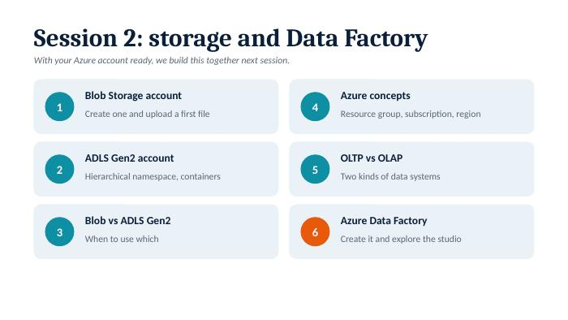

- With your Azure account ready, we build this together next session.
1. Blob Storage account — 4 — Azure concepts
- Create one and upload a first file | Resource group, subscription, region
2. ADLS Gen2 account — 5 — OLTP vs OLAP
- Hierarchical namespace, containers | Two kinds of data systems
3. Blob vs ADLS Gen2 — 6 — Azure Data Factory
- When to use which | Create it and explore the studio

---

## Slide 17: Before Session 2

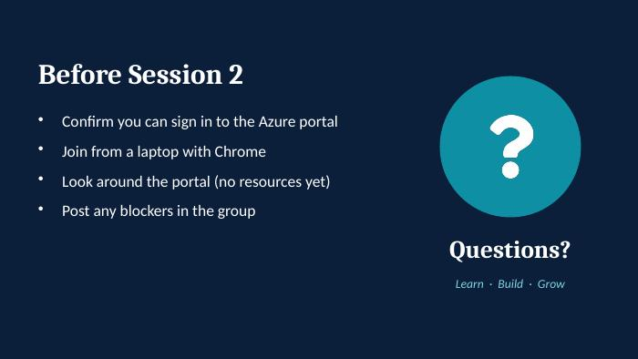

  - Confirm you can sign in to the Azure portal
  - Join from a laptop with Chrome
  - Look around the portal (no resources yet)
  - Post any blockers in the group
- Questions?
- Learn  ·  Build  ·  Grow

---
