# Session 2: Storage Account and ADF: Slides

Each slide as an image, with its text underneath. See [study-guide.md](study-guide.md) for the full explanation, steps and practice. You can also [download the slides as PDF](slides.pdf).

---

## Slide 1: Storage Account & Azure Data Factory

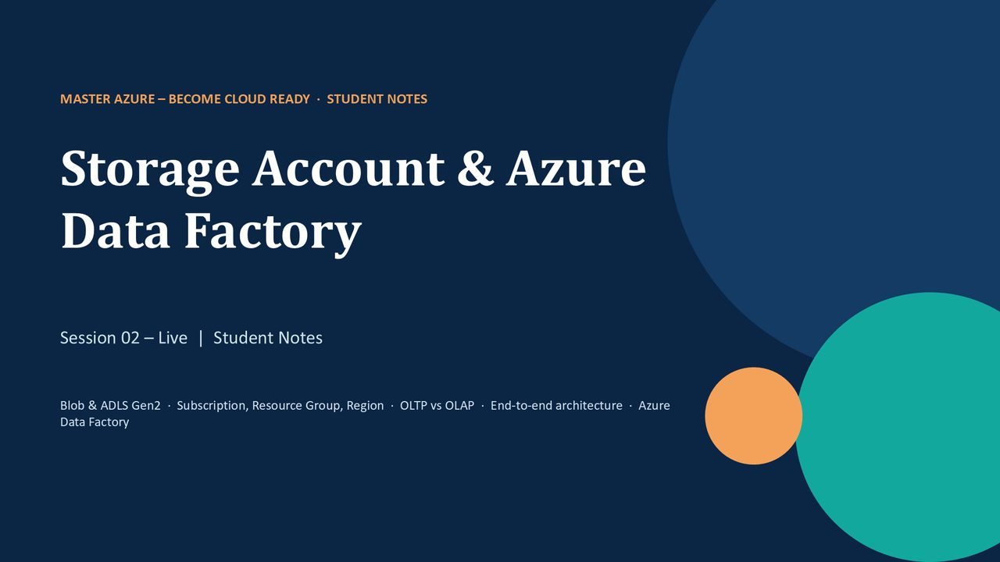

- Session 02 – Live  |  Student Notes

---

## Slide 2: Introduction: why this session matters

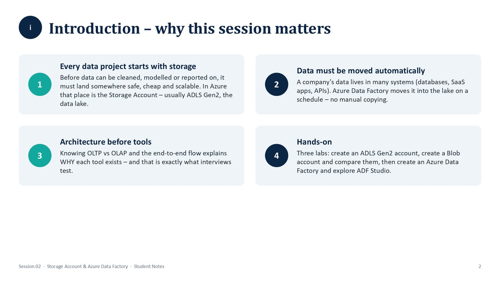

- **Every data project starts with storage:** Before data can be cleaned, modelled or reported on, it must land somewhere safe, cheap and scalable. In Azure that place is the Storage Account – usually ADLS Gen2, the data lake.
- **Data must be moved automatically:** A company's data lives in many systems (databases, SaaS apps, APIs). Azure Data Factory moves it into the lake on a schedule – no manual copying.
- **Architecture before tools:** Knowing OLTP vs OLAP and the end-to-end flow explains WHY each tool exists – and that is exactly what interviews test.
- **Hands-on:** Three labs: create an ADLS Gen2 account, create a Blob account and compare them, then create an Azure Data Factory and explore ADF Studio.

---

## Slide 3: Session 01 recap: Cloud Fundamentals

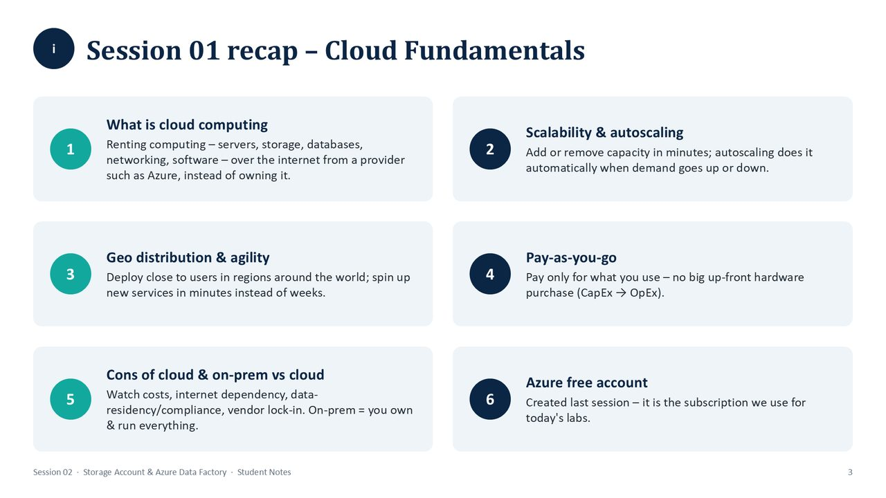

- **What is cloud computing:** Renting computing – servers, storage, databases, networking, software – over the internet from a provider such as Azure, instead of owning it.
- **Scalability & autoscaling:** Add or remove capacity in minutes; autoscaling does it automatically when demand goes up or down.
- **Geo distribution & agility:** Deploy close to users in regions around the world; spin up new services in minutes instead of weeks.
- **Pay-as-you-go:** Pay only for what you use – no big up-front hardware purchase (CapEx → OpEx).
- **Cons of cloud & on-prem vs cloud:** Watch costs, internet dependency, data-residency/compliance, vendor lock-in. On-prem = you own & run everything.
- **Azure free account:** Created last session – it is the subscription we use for today's labs.

---

## Slide 4: Learning objectives

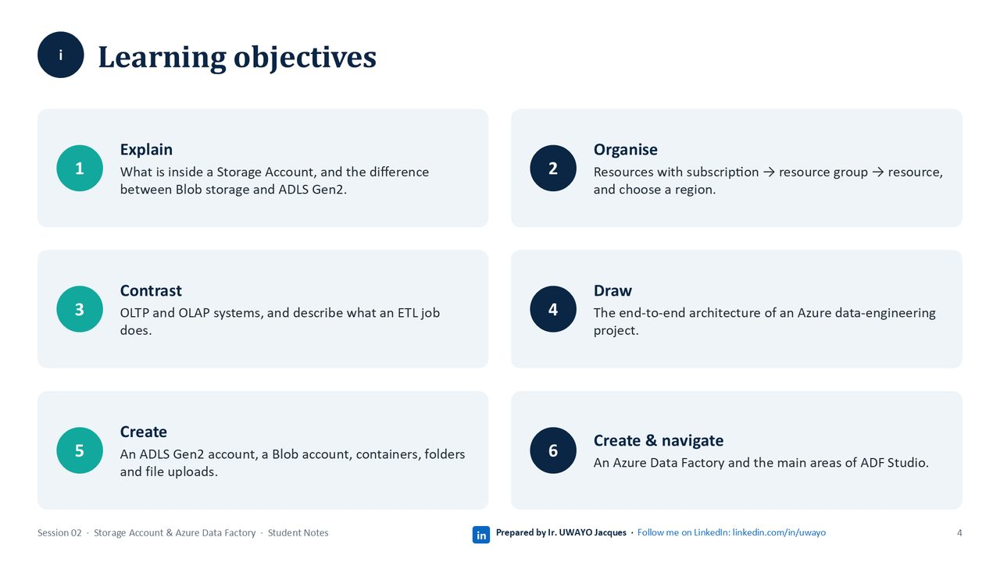

- **Explain:** What is inside a Storage Account, and the difference between Blob storage and ADLS Gen2.
- **Organise:** Resources with subscription → resource group → resource, and choose a region.
- **Contrast:** OLTP and OLAP systems, and describe what an ETL job does.
- **Draw:** The end-to-end architecture of an Azure data-engineering project.
- **Create:** An ADLS Gen2 account, a Blob account, containers, folders and file uploads.
- **Create & navigate:** An Azure Data Factory and the main areas of ADF Studio.

---

## Slide 5: Agenda

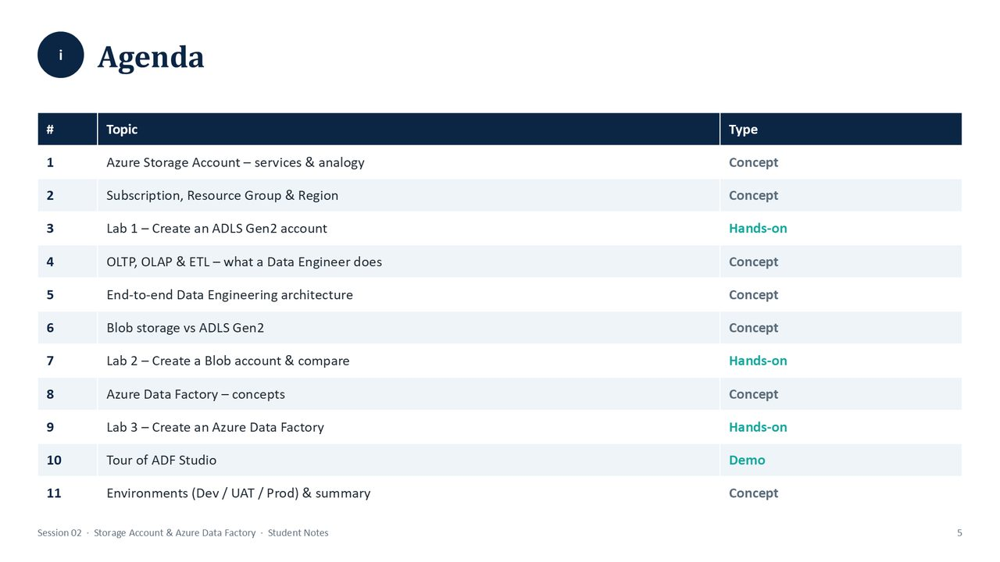

| # | Topic | Type |
| --- | --- | --- |
| 1 | Azure Storage Account – services & analogy | Concept |
| 2 | Subscription, Resource Group & Region | Concept |
| 3 | Lab 1 – Create an ADLS Gen2 account | Hands-on |
| 4 | OLTP, OLAP & ETL – what a Data Engineer does | Concept |
| 5 | End-to-end Data Engineering architecture | Concept |
| 6 | Blob storage vs ADLS Gen2 | Concept |
| 7 | Lab 2 – Create a Blob account & compare | Hands-on |
| 8 | Azure Data Factory – concepts | Concept |
| 9 | Lab 3 – Create an Azure Data Factory | Hands-on |
| 10 | Tour of ADF Studio | Demo |
| 11 | Environments (Dev / UAT / Prod) & summary | Concept |

---

## Slide 6: Before you start: lab setup

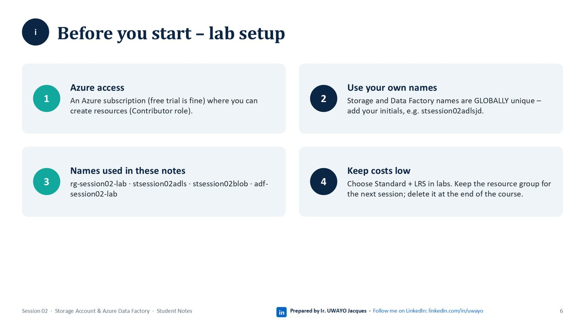

- **Azure access:** An Azure subscription (free trial is fine) where you can create resources (Contributor role).
- **Use your own names:** Storage and Data Factory names are GLOBALLY unique – add your initials, e.g. stsession02adlsjd.
- **Names used in these notes:** rg-session02-lab · stsession02adls · stsession02blob · adf-session02-lab
- **Keep costs low:** Choose Standard + LRS in labs. Keep the resource group for the next session; delete it at the end of the course.

---

## Slide 7: Part 1: Azure Storage Account

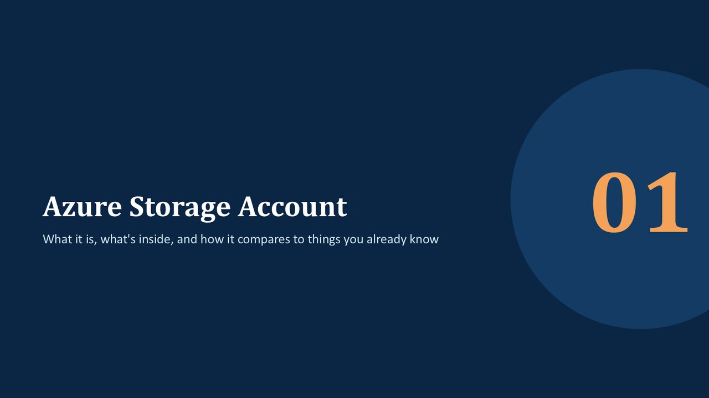

- What it is, what's inside, and how it compares to things you already know

---

## Slide 8: What's inside a Storage Account

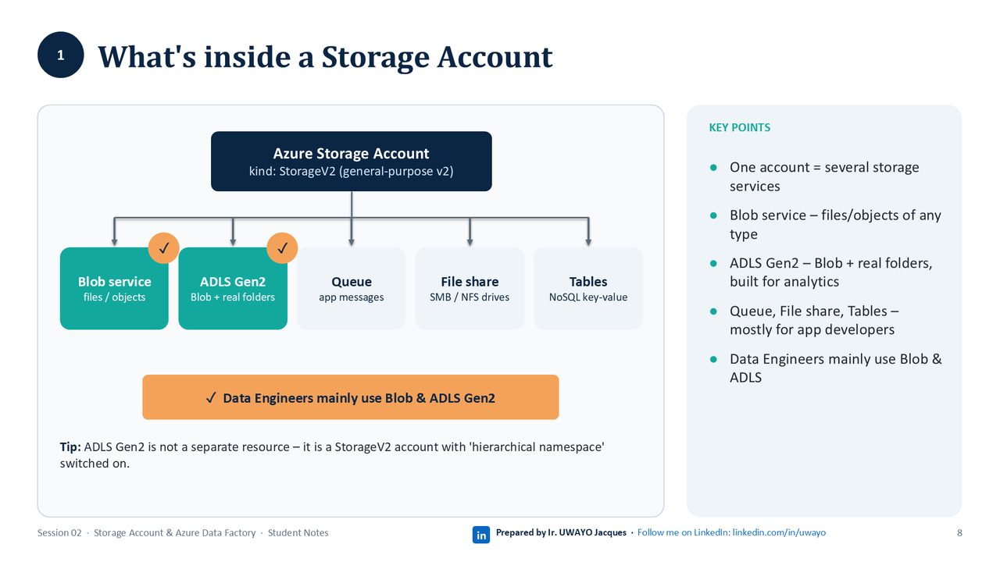

- One account = several storage services
- Blob service – files/objects of any type
- ADLS Gen2 – Blob + real folders, built for analytics
- Queue, File share, Tables – mostly for app developers
- Data Engineers mainly use Blob & ADLS

---

## Slide 9: An analogy you already know

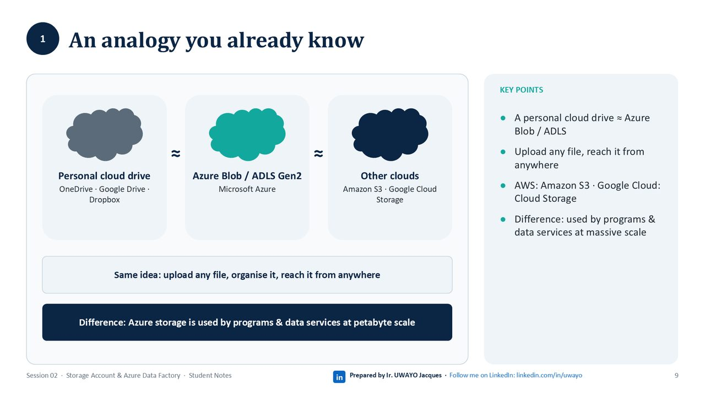

- A personal cloud drive ≈ Azure Blob / ADLS
- Upload any file, reach it from anywhere
- AWS: Amazon S3 · Google Cloud: Cloud Storage
- Difference: used by programs & data services at massive scale

---

## Slide 10: Storage center in the Azure portal

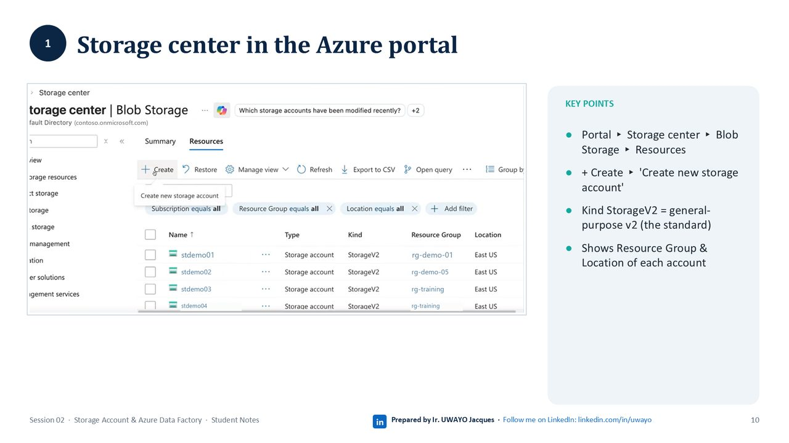

- Portal ▸ Storage center ▸ Blob Storage ▸ Resources
- + Create ▸ 'Create new storage account'
- Kind StorageV2 = general-purpose v2 (the standard)
- Shows Resource Group & Location of each account

---

## Slide 11: Part 2: Subscription, Resource Group & Region

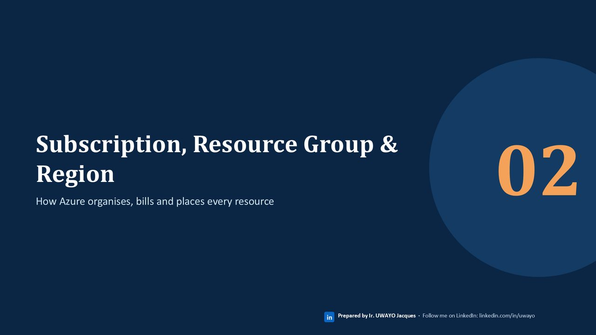

- How Azure organises, bills and places every resource

---

## Slide 12: The Azure resource hierarchy

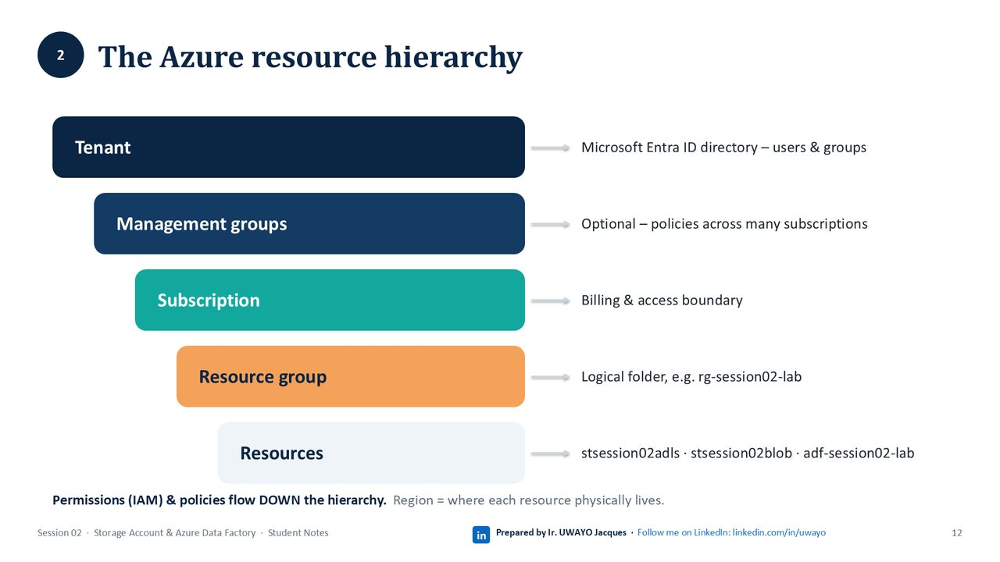

- Tenant → Management groups (optional) → Subscription → Resource group → Resources
- Permissions (IAM) and policies flow down the hierarchy. Region = where each resource physically lives.

---

## Slide 13: Subscription: the billing boundary

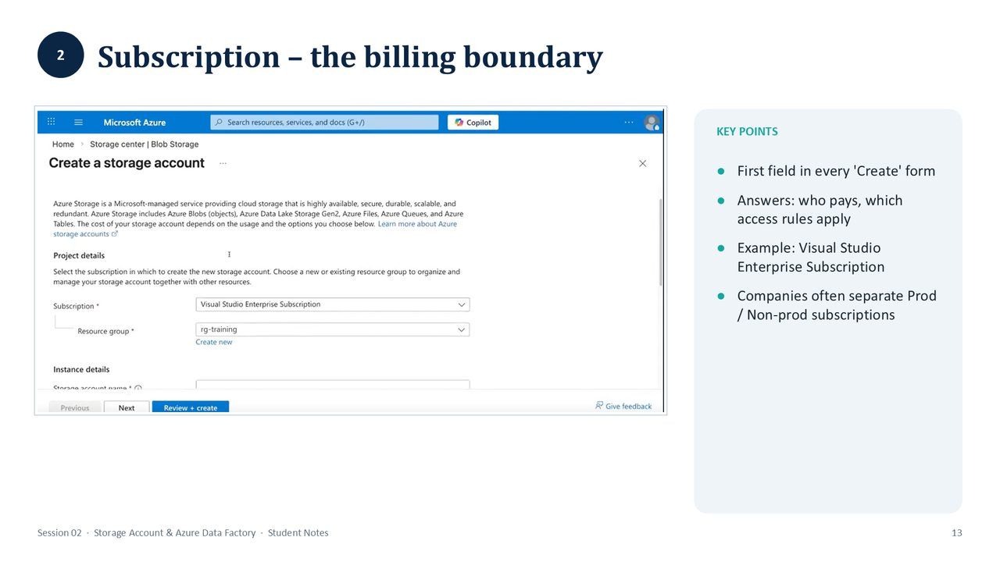

- First field in every 'Create' form
- Answers: who pays, which access rules apply
- Example: Visual Studio Enterprise Subscription
- Companies often separate Prod / Non-prod subscriptions

---

## Slide 14: Why resource groups exist

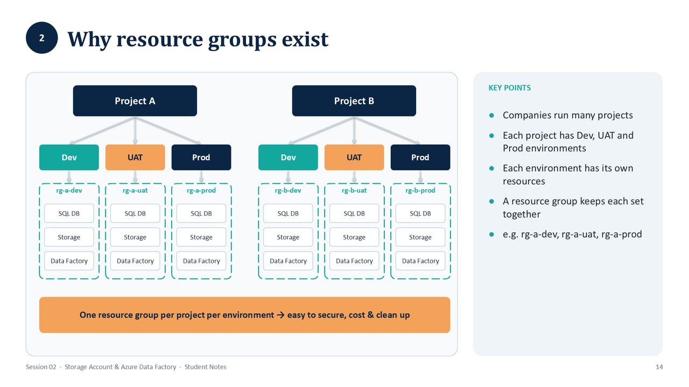

- Companies run many projects
- Each project has Dev, UAT and Prod environments
- Each environment has its own resources
- A resource group keeps each set together
- e.g. rg-a-dev, rg-a-uat, rg-a-prod

---

## Slide 15: A real resource group

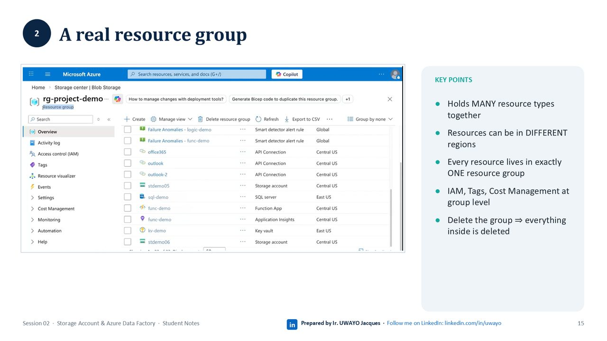

- Holds MANY resource types together
- Resources can be in DIFFERENT regions
- Every resource lives in exactly ONE resource group
- IAM, Tags, Cost Management at group level
- Delete the group ⇒ everything inside is deleted

---

## Slide 16: Create a new resource group

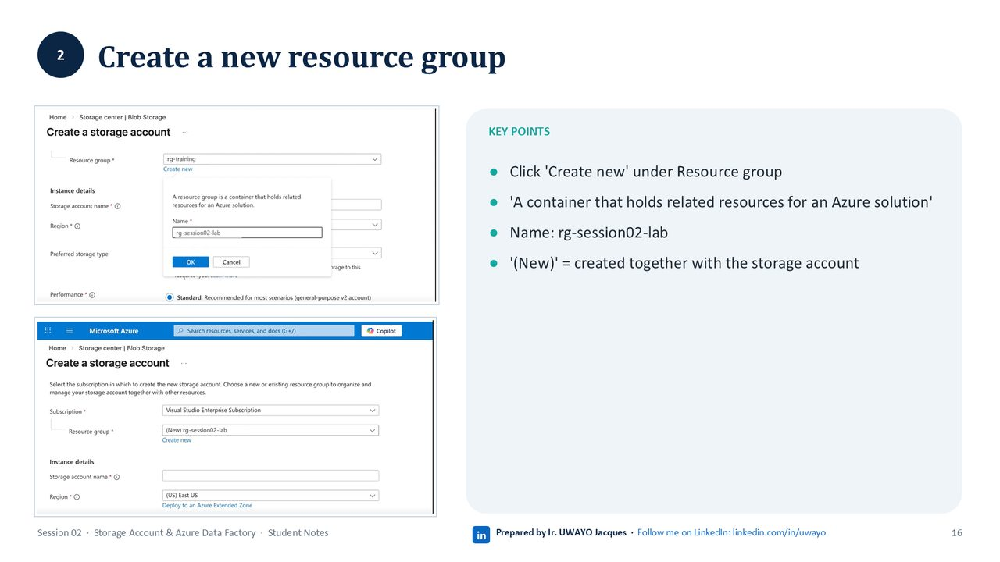

- Click 'Create new' under Resource group
- 'A container that holds related resources for an Azure solution'
- Name: rg-session02-lab
- '(New)' = created together with the storage account

---

## Slide 17: Region: where your data physically lives

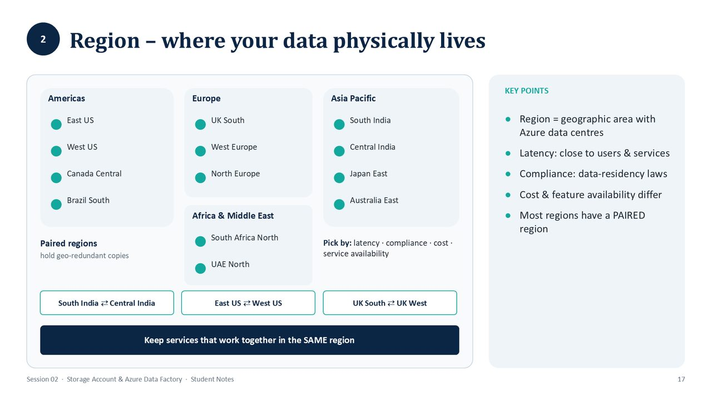

- Region = geographic area with Azure data centres
- Latency: close to users & services
- Compliance: data-residency laws
- Cost & feature availability differ
- Most regions have a PAIRED region

---

## Slide 18: Instance details: name & region

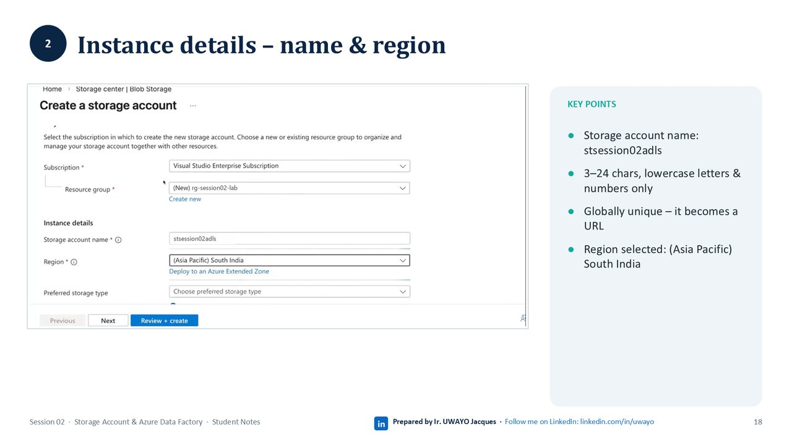

- Storage account name: stsession02adls
- 3–24 chars, lowercase letters & numbers only
- Globally unique – it becomes a URL
- Region selected: (Asia Pacific) South India

---

## Slide 19: Part 3: Lab 1: Create an ADLS Gen2 Account

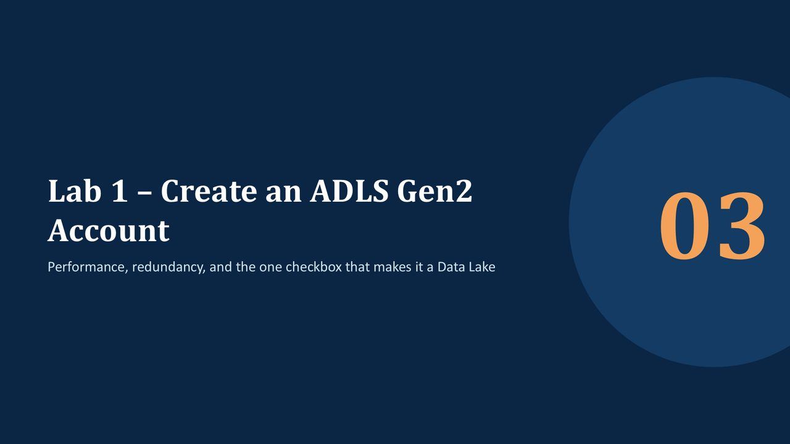

- Performance, redundancy, and the one checkbox that makes it a Data Lake

---

## Slide 20: Performance & redundancy

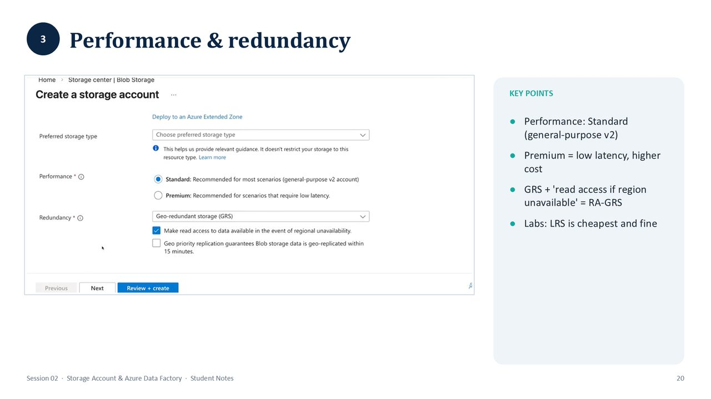

- Performance: Standard (general-purpose v2)
- Premium = low latency, higher cost
- GRS + 'read access if region unavailable' = RA-GRS
- Labs: LRS is cheapest and fine

---

## Slide 21: Advanced tab: hierarchical namespace

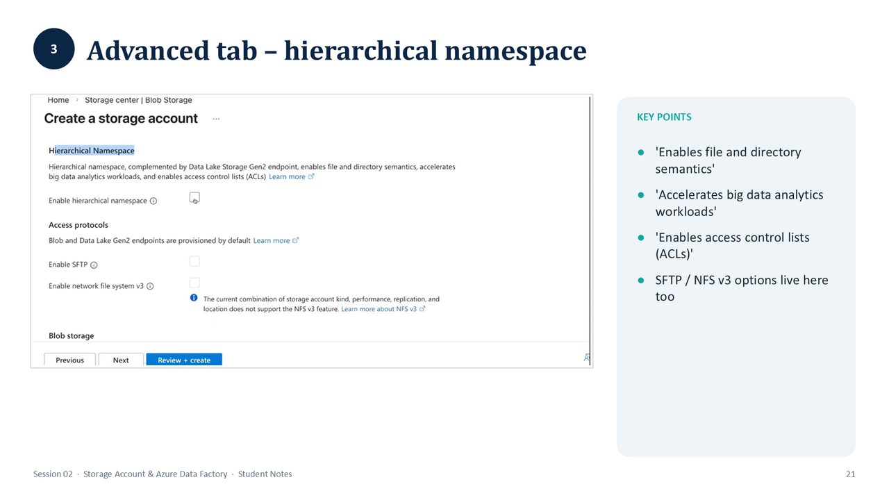

- 'Enables file and directory semantics'
- 'Accelerates big data analytics workloads'
- 'Enables access control lists (ACLs)'
- SFTP / NFS v3 options live here too

---

## Slide 22: ✔ Enable hierarchical namespace

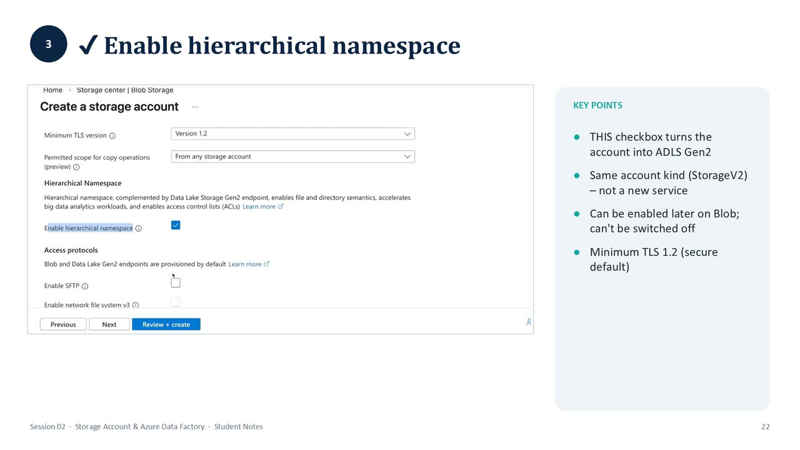

- THIS checkbox turns the account into ADLS Gen2
- Same account kind (StorageV2) – not a new service
- Can be enabled later on Blob; can't be switched off
- Minimum TLS 1.2 (secure default)

---

## Slide 23: Wizard tabs & Tags

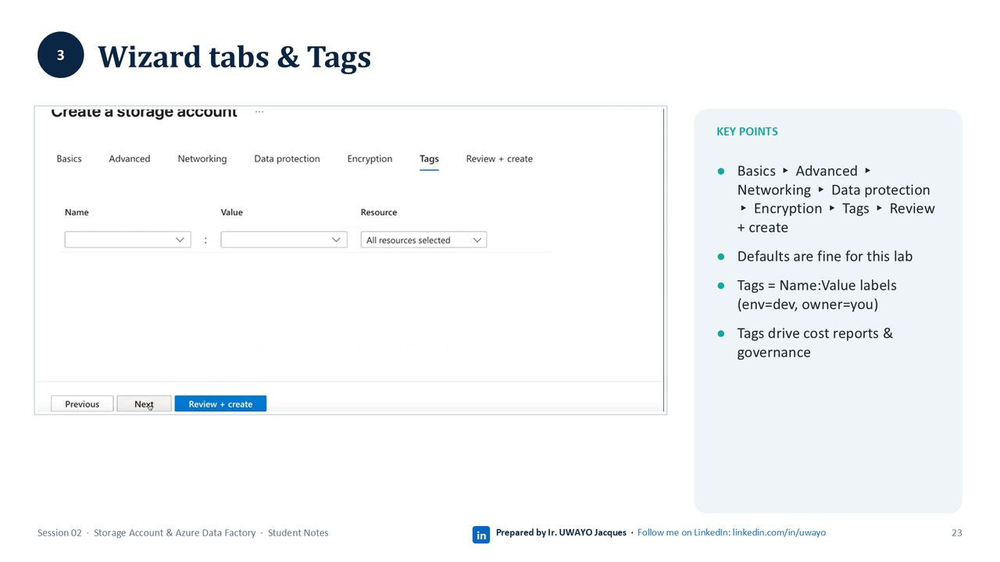

- Basics ▸ Advanced ▸ Networking ▸ Data protection ▸ Encryption ▸ Tags ▸ Review + create
- Defaults are fine for this lab
- Tags = Name:Value labels (env=dev, owner=you)
- Tags drive cost reports & governance

---

## Slide 24: Review + create

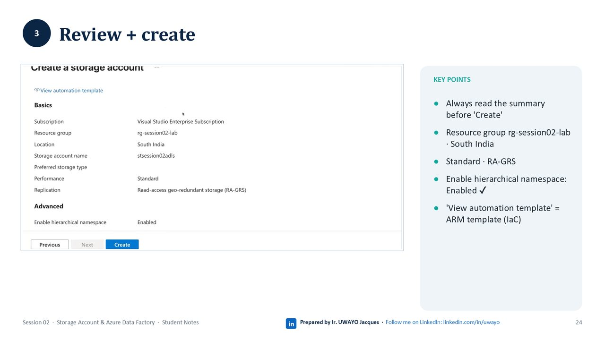

- Always read the summary before 'Create'
- Resource group rg-session02-lab · South India
- Standard · RA-GRS
- Enable hierarchical namespace: Enabled ✔
- 'View automation template' = ARM template (IaC)

---

## Slide 25: Security defaults & deployment

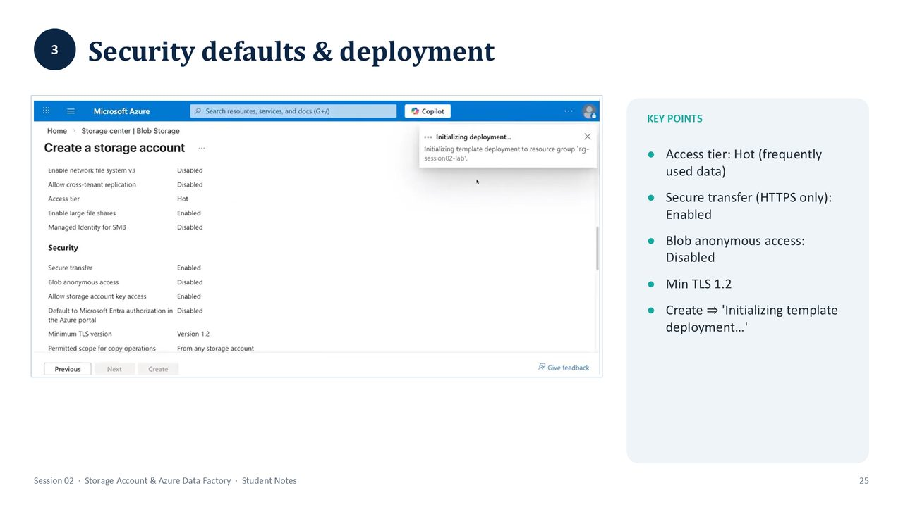

- Access tier: Hot (frequently used data)
- Secure transfer (HTTPS only): Enabled
- Blob anonymous access: Disabled
- Min TLS 1.2
- Create ⇒ 'Initializing template deployment…'

---

## Slide 26: Deployment succeeded

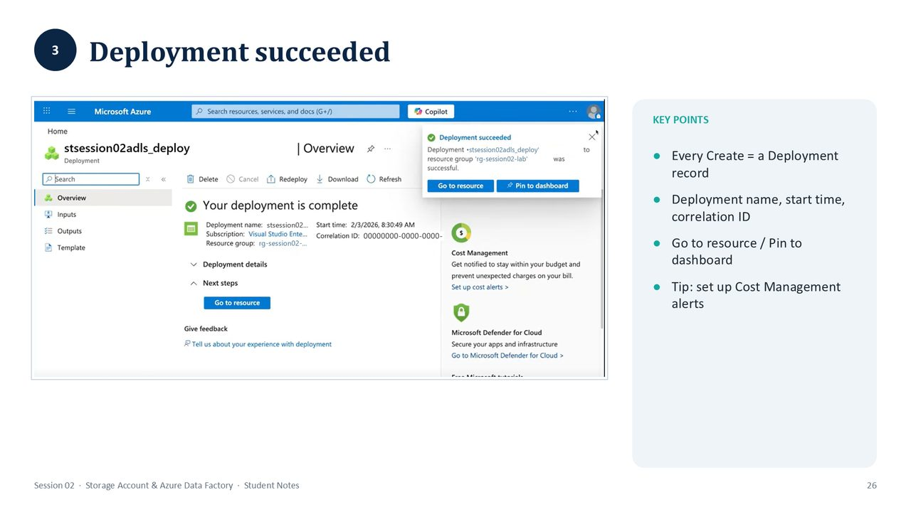

- Every Create = a Deployment record
- Deployment name, start time, correlation ID
- Go to resource / Pin to dashboard
- Tip: set up Cost Management alerts

---

## Slide 27: Storage account overview

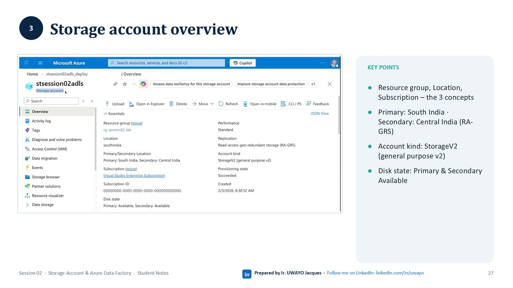

- Resource group, Location, Subscription – the 3 concepts
- Primary: South India · Secondary: Central India (RA-GRS)
- Account kind: StorageV2 (general purpose v2)
- Disk state: Primary & Secondary Available

---

## Slide 28: Containers: create 'landing'

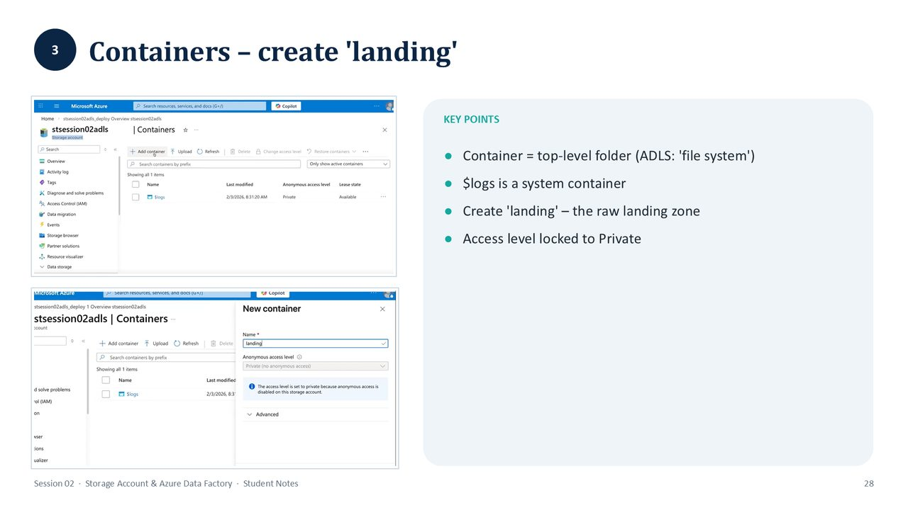

- Container = top-level folder (ADLS: 'file system')
- $logs is a system container
- Create 'landing' – the raw landing zone
- Access level locked to Private

---

## Slide 29: Inside the container (ADLS)

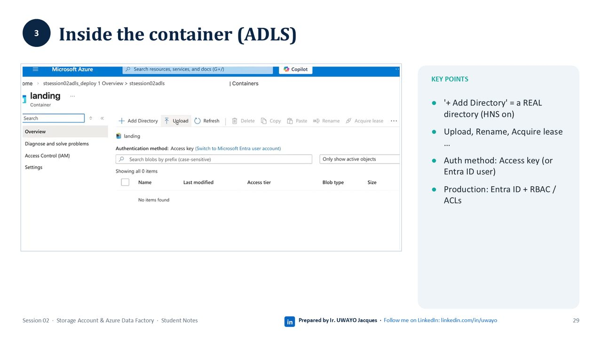

- '+ Add Directory' = a REAL directory (HNS on)
- Upload, Rename, Acquire lease …
- Auth method: Access key (or Entra ID user)
- Production: Entra ID + RBAC / ACLs

---

## Slide 30: Upload a file

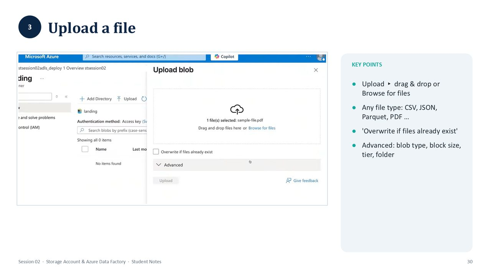

- Upload ▸ drag & drop or Browse for files
- Any file type: CSV, JSON, Parquet, PDF …
- 'Overwrite if files already exist'
- Advanced: blob type, block size, tier, folder

---

## Slide 31: Part 4: OLTP, OLAP & ETL

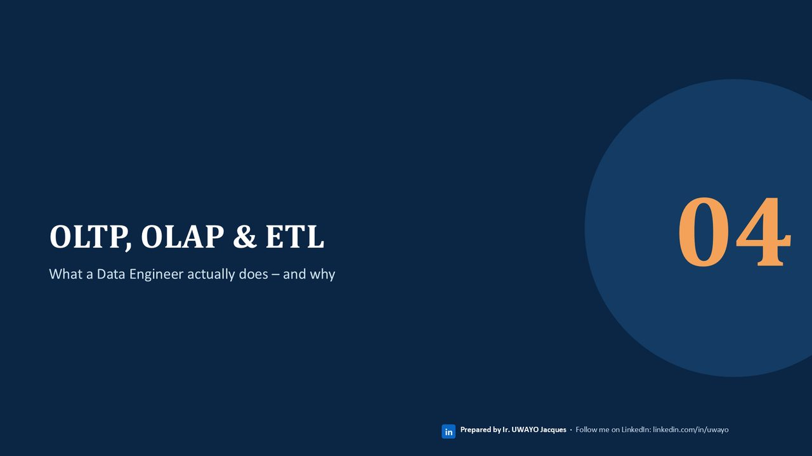

- What a Data Engineer actually does – and why

---

## Slide 32: OLTP: the application database

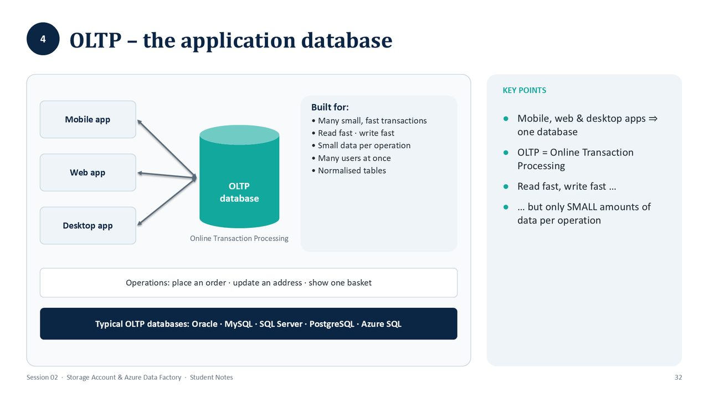

- Mobile, web & desktop apps ⇒ one database
- OLTP = Online Transaction Processing
- Read fast, write fast …
- … but only SMALL amounts of data per operation

---

## Slide 33: The problem: analytics on OLTP

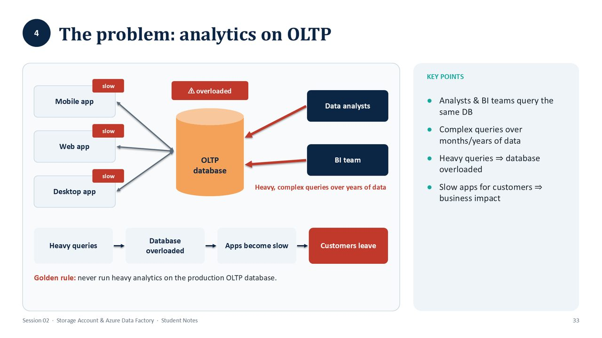

- Analysts & BI teams query the same DB
- Complex queries over months/years of data
- Heavy queries ⇒ database overloaded
- Slow apps for customers ⇒ business impact

---

## Slide 34: The solution: a separate OLAP system

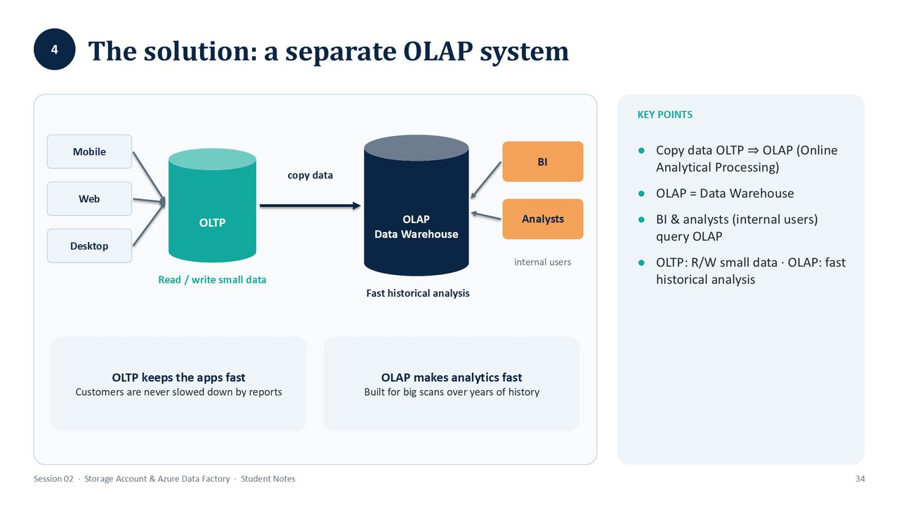

- Copy data OLTP ⇒ OLAP (Online Analytical Processing)
- OLAP = Data Warehouse
- BI & analysts (internal users) query OLAP
- OLTP: R/W small data · OLAP: fast historical analysis

---

## Slide 35: ETL: the bridge (the Data Engineer's job)

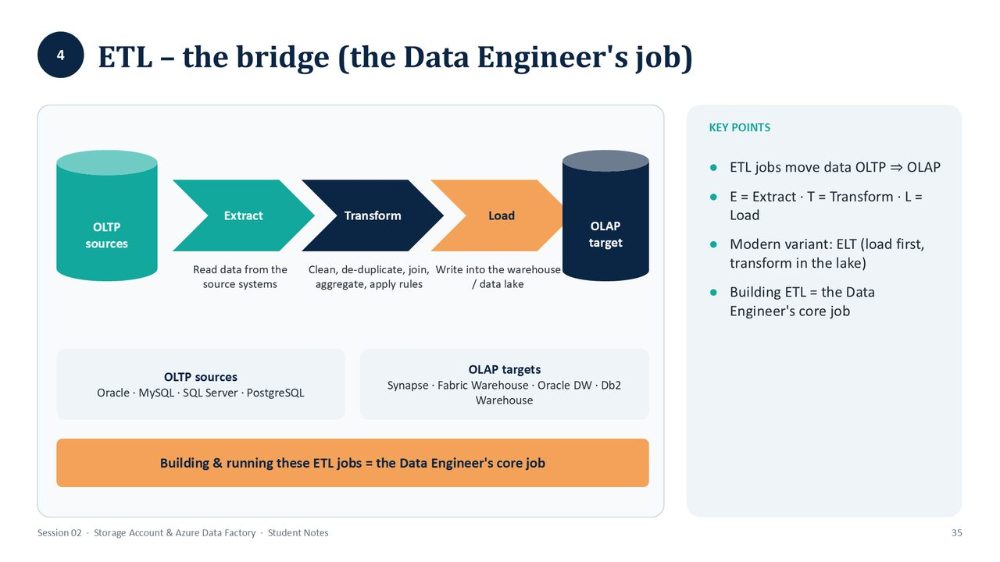

- ETL jobs move data OLTP ⇒ OLAP
- E = Extract · T = Transform · L = Load
- Modern variant: ELT (load first, transform in the lake)
- Building ETL = the Data Engineer's core job

---

## Slide 36: OLTP vs OLAP

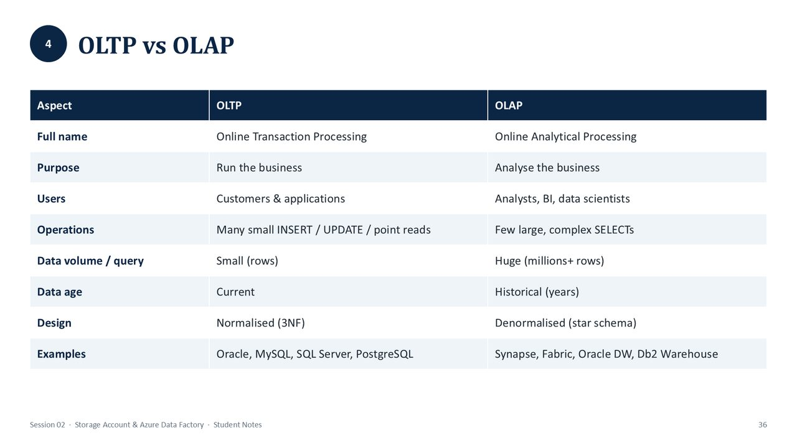

| Aspect | OLTP | OLAP |
| --- | --- | --- |
| Full name | Online Transaction Processing | Online Analytical Processing |
| Purpose | Run the business | Analyse the business |
| Users | Customers & applications | Analysts, BI, data scientists |
| Operations | Many small INSERT / UPDATE / point reads | Few large, complex SELECTs |
| Data volume / query | Small (rows) | Huge (millions+ rows) |
| Data age | Current | Historical (years) |
| Design | Normalised (3NF) | Denormalised (star schema) |
| Examples | Oracle, MySQL, SQL Server, PostgreSQL | Synapse, Fabric, Oracle DW, Db2 Warehouse |

---

## Slide 37: Part 5: End-to-End Data Engineering Architecture

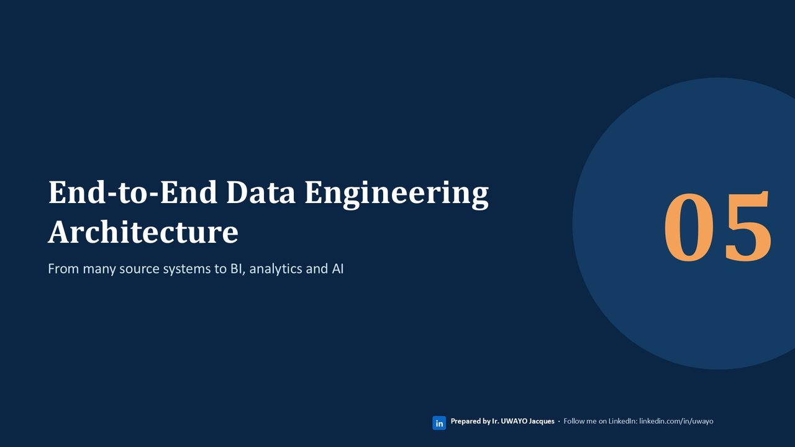

- From many source systems to BI, analytics and AI

---

## Slide 38: Many sources → ingestion → ADLS

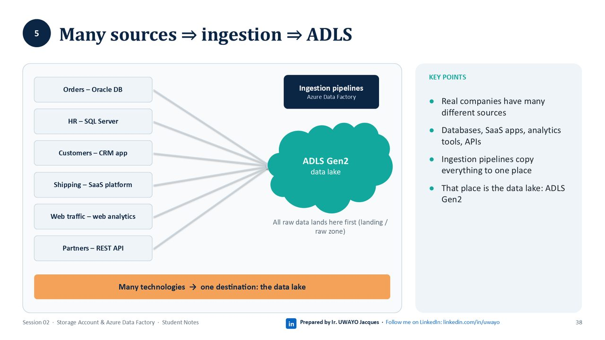

- Real companies have many different sources
- Databases, SaaS apps, analytics tools, APIs
- Ingestion pipelines copy everything to one place
- That place is the data lake: ADLS Gen2

---

## Slide 39: Clean & arrange → serve

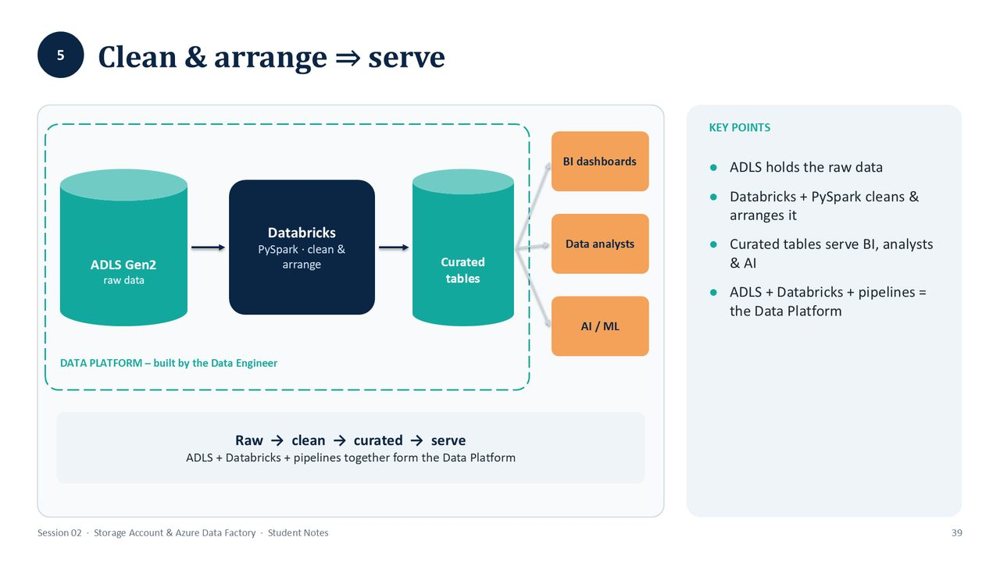

- ADLS holds the raw data
- Databricks + PySpark cleans & arranges it
- Curated tables serve BI, analysts & AI
- ADLS + Databricks + pipelines = the Data Platform

---

## Slide 40: Reference architecture: the big picture

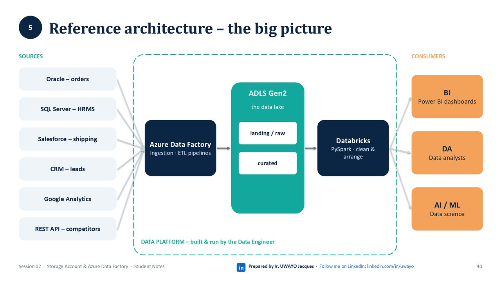

- Sources (Oracle, SQL Server, Salesforce, CRM, Google Analytics, REST API) → Azure Data Factory → ADLS Gen2 (landing / raw, curated) → Databricks (PySpark) → BI, data analysts, AI / ML
- The data platform is built and run by the data engineer.

---

## Slide 41: Part 6: Blob Storage vs ADLS Gen2

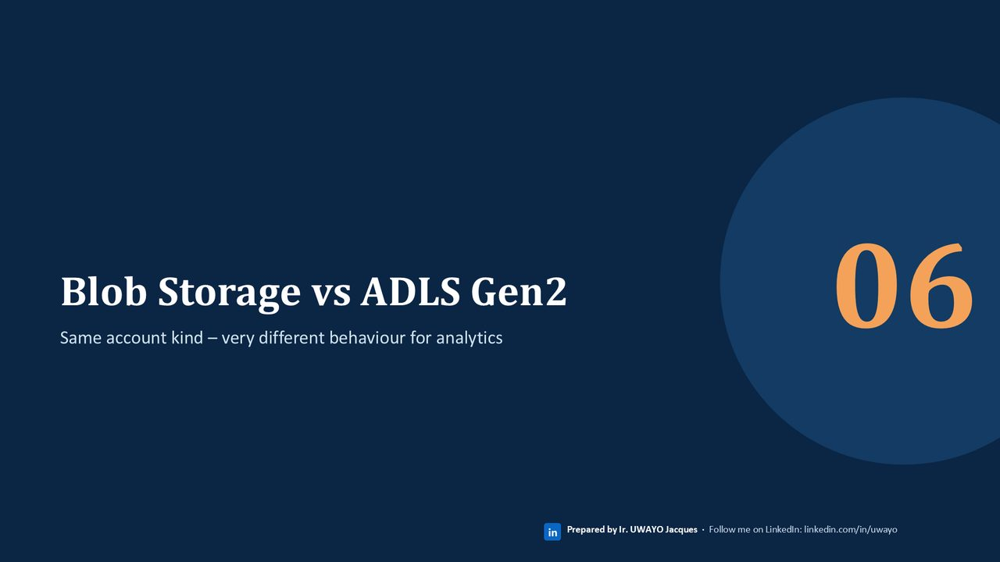

- Same account kind – very different behaviour for analytics

---

## Slide 42: Flat vs hierarchical namespace

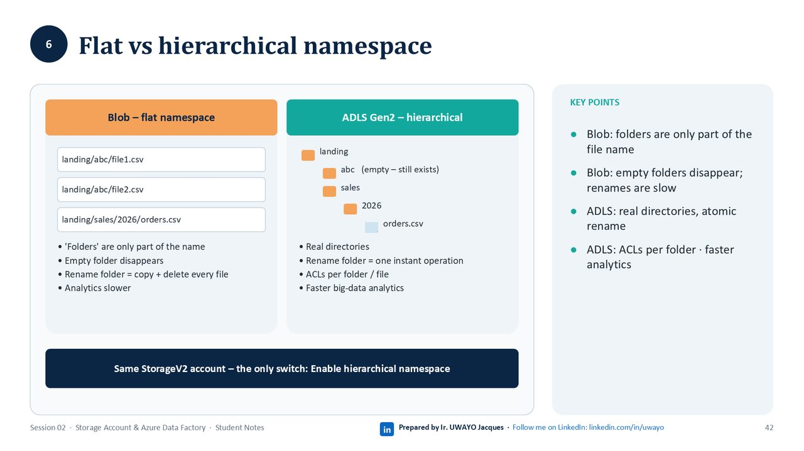

- Blob: folders are only part of the file name
- Blob: empty folders disappear; renames are slow
- ADLS: real directories, atomic rename
- ADLS: ACLs per folder · faster analytics

---

## Slide 43: When is Blob the right choice?

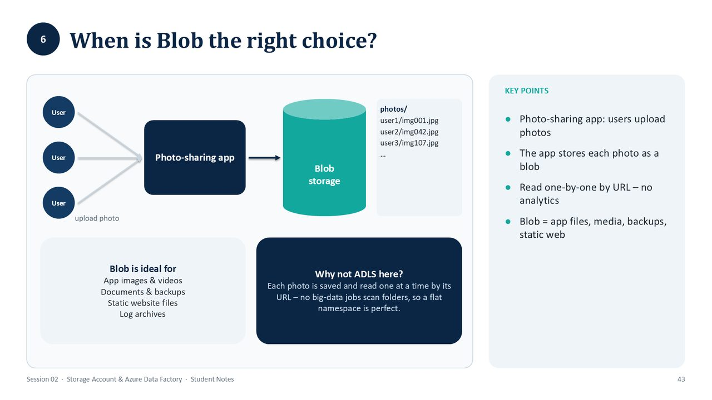

- Photo-sharing app: users upload photos
- The app stores each photo as a blob
- Read one-by-one by URL – no analytics
- Blob = app files, media, backups, static web

---

## Slide 44: Blob storage vs ADLS Gen2: full comparison

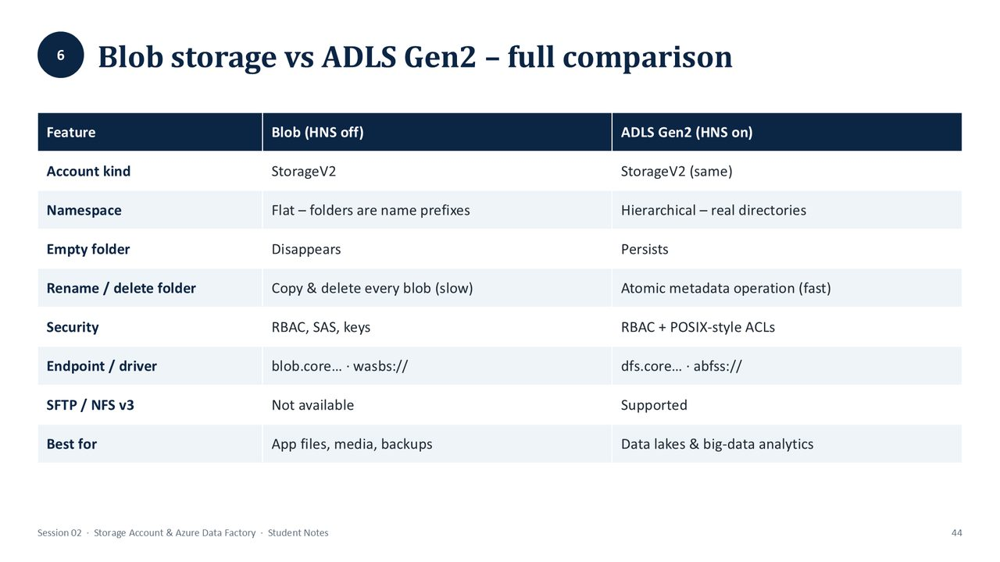

| Feature | Blob (HNS off) | ADLS Gen2 (HNS on) |
| --- | --- | --- |
| Account kind | StorageV2 | StorageV2 (same) |
| Namespace | Flat – folders are name prefixes | Hierarchical – real directories |
| Empty folder | Disappears | Persists |
| Rename / delete folder | Copy & delete every blob (slow) | Atomic metadata operation (fast) |
| Security | RBAC, SAS, keys | RBAC + POSIX-style ACLs |
| Endpoint / driver | blob.core… · wasbs:// | dfs.core… · abfss:// |
| SFTP / NFS v3 | Not available | Supported |
| Best for | App files, media, backups | Data lakes & big-data analytics |

---

## Slide 45: Part 7: Lab 2: Create a Blob Storage Account

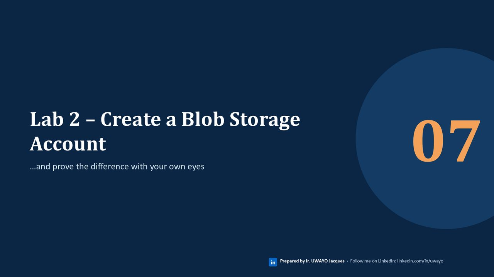

- …and prove the difference with your own eyes

---

## Slide 46: Basics for the Blob account

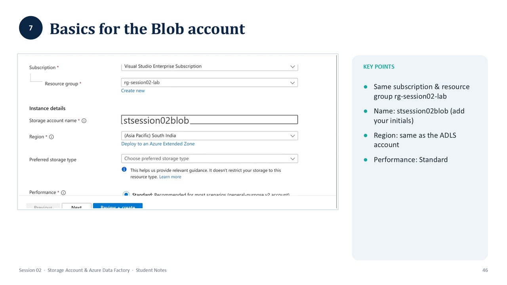

- Same subscription & resource group rg-session02-lab
- Name: stsession02blob (add your initials)
- Region: same as the ADLS account
- Performance: Standard

---

## Slide 47: Leave hierarchical namespace OFF

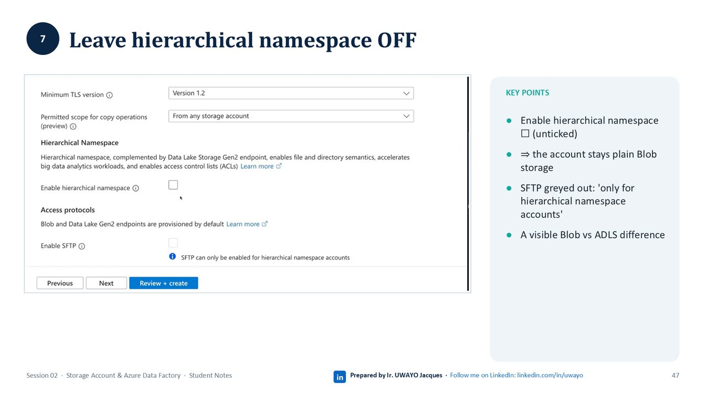

- Enable hierarchical namespace ☐ (unticked)
- ⇒ the account stays plain Blob storage
- SFTP greyed out: 'only for hierarchical namespace accounts'
- A visible Blob vs ADLS difference

---

## Slide 48: Review, deploy & overview

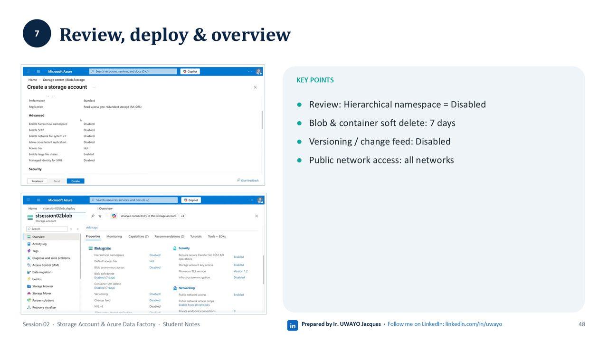

- Review: Hierarchical namespace = Disabled
- Blob & container soft delete: 7 days
- Versioning / change feed: Disabled
- Public network access: all networks

---

## Slide 49: Blob container: 'Add virtual directory'

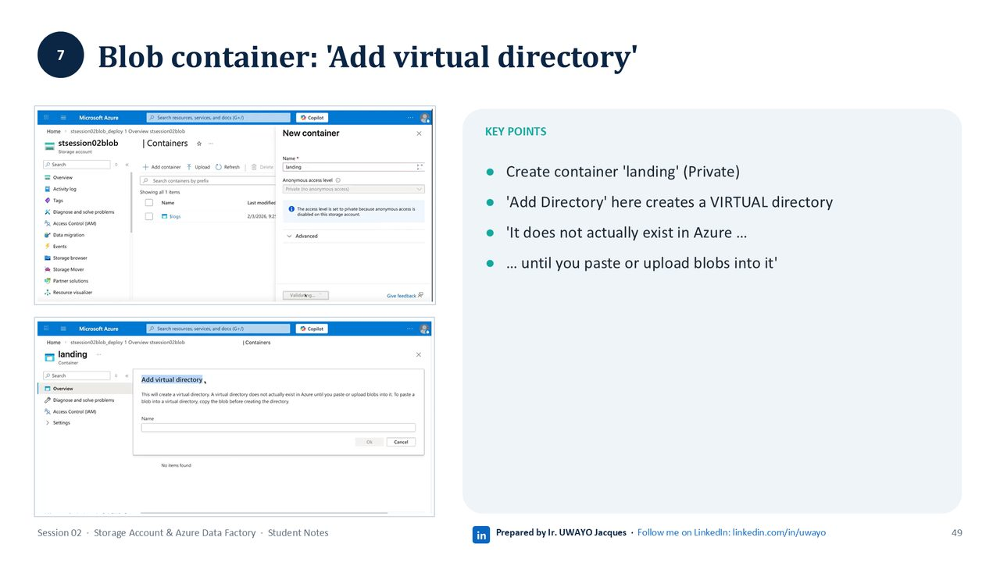

- Create container 'landing' (Private)
- 'Add Directory' here creates a VIRTUAL directory
- 'It does not actually exist in Azure …
- … until you paste or upload blobs into it'

---

## Slide 50: Proof: ADLS vs Blob after the same steps

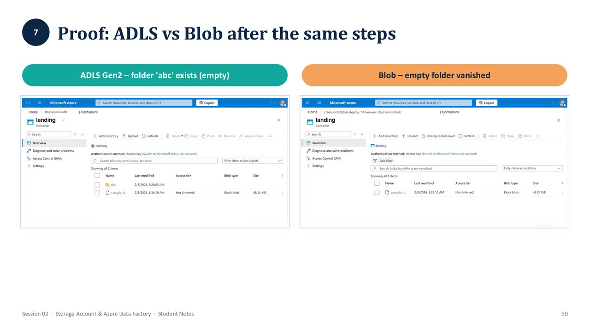

- ADLS Gen2 – folder 'abc' exists (empty)
- Blob – empty folder vanished

---

## Slide 51: Part 8: Azure Data Factory: Concepts


- Azure's cloud ETL & orchestration service

---

## Slide 52: What is Azure Data Factory?


- ADF = ETL jobs = data pipelines
- MOVES data from sources to destinations
- ORCHESTRATES transformations (e.g. Databricks)
- Low-code visual designer

---

## Slide 53: ETL tools in the market


- Traditional: SSIS, Informatica, IBM DataStage
- Code-based orchestration: Apache Airflow
- On Azure ⇒ ADF is the native choice
- Serverless, pay-per-use, deep Azure integration

---

## Slide 54: ADF: plug & play


- Connect a source (linked service)
- Connect a destination
- Configure a Copy activity
- Trigger it on a schedule, then monitor

---

## Slide 55: Storage vs ADF: where vs how


- Storage account holds files: 1 … millions
- One Data Factory holds many pipelines
- Storage = WHERE data lives
- ADF = HOW and WHEN data moves

---

## Slide 56: Who creates these resources?


- Usually NOT the Data Engineer in big companies
- Platform / infra / cloud teams provision resources
- Often with Infrastructure-as-Code
- Data Engineers build pipelines & transformations inside

---

## Slide 57: Part 9: Lab 3: Create an Azure Data Factory


- Basics, review, deployment – and what to do when it fails

---

## Slide 58: Find the service


- Search 'data factory' in the portal
- Services ▸ Data factories
- 'Recent' shows the resources created earlier

---

## Slide 59: Data factories list & naming


- All factories are 'Data factory (V2)'
- Suffixes show environments: -dev, -uat, -prod
- Good names make environments obvious
- Click + Create

---

## Slide 60: Create Data Factory: Basics


- Tabs: Basics · Git configuration · Networking · Advanced · Tags
- Resource group: rg-session02-lab
- Name: adf-session02-lab (globally unique)
- Region & Version V2
- Banner: Fabric Data Factory = newer SaaS option

---

## Slide 61: Review + create


- Summary: subscription, RG, name, region, V2
- 'View automation template' again
- Create ⇒ deployment starts

---

## Slide 62: When a deployment fails


- Status: InternalServerError (temporary platform error)
- Open 'Operation details' to read the real error
- RG shows only the 2 storage accounts – no factory
- Fix: Redeploy / create again

---

## Slide 63: Resource-group clean-up & redeploy


- Delete resource group ⇒ ALL resources inside deleted
- Type the RG name to confirm
- Delete lab RGs when a course is finished
- Redeploy ⇒ a new deployment from the template

---

## Slide 64: Part 10: Tour of ADF Studio


- Where Data Engineers spend their time

---

## Slide 65: Launch ADF Studio


- Factory Overview ▸ 'Launch studio'
- Opens adf.azure.com
- Portal = manage the resource
- Studio = build, debug, publish, monitor

---

## Slide 66: Author hub: Factory Resources


- Pipelines · Datasets · Data flows · Power Query · Templates
- Change Data Capture (preview)
- Git branch 'main' · Validate all · Publish
- Hubs: Home · Author · Monitor · Manage · Learning

---

## Slide 67: Example pipelines: what's coming next


- ForEach, Get Metadata, If Condition, Lookup
- Parameters & variables
- Ingestion into ADLS
- REST API ingestion

---

## Slide 68: Pipeline canvas & activities


- Activities: Move and transform ▸ Copy data, Data flow
- Also Databricks, Azure Function, HDInsight, General …
- Activity tabs: General · Source · Sink · Mapping · Settings
- Toolbar: Validate · Debug · Add trigger

---

## Slide 69: Chaining activities


- Copy data1 ⇒ Copy data2 ⇒ Copy data3
- Green arrow = 'on success' dependency
- General: Timeout 12 h · Retry 0 · Interval 30 s
- Add retries for unreliable sources

---

## Slide 70: Copy activity: Source


- Source dataset: CSV_ADLS_DS (CSV on ADLS)
- Dataset parameter folderName ⇒ reusable dataset
- File path type: dataset path · wildcard · list of files
- Preview data before running

---

## Slide 71: ADF building blocks


| Component | Meaning | Analogy |
| --- | --- | --- |
| Pipeline | A workflow – the ETL job | The recipe |
| Activity | One step (Copy, Lookup, ForEach, Notebook …) | A step in the recipe |
| Dataset | WHAT data – file, folder or table | The ingredient |
| Linked service | WHERE/HOW to connect – connection info | The shop address + key |
| Integration runtime | The compute that runs activities | The kitchen |
| Trigger | WHEN – schedule, tumbling window, event | The timer |

---

## Slide 72: Part 11: Environments & Summary


- Dev · UAT · Prod – and everything learned today

---

## Slide 73: Dev / UAT / Prod environments


- Each project has Dev, UAT and Prod
- Each environment has its OWN ADF and storage
- Dev: build · UAT: business validates · Prod: live
- Git + CI/CD promotes changes – never edit Prod by hand

---

## Slide 74: Key takeaways


- **Storage Account:** Container for Blob, ADLS, Files, Queues, Tables – kind StorageV2.
- **ADLS Gen2:** = StorageV2 + hierarchical namespace – real folders, ACLs, fast analytics.
- **Hierarchy:** Tenant ▸ Subscription (billing) ▸ Resource group (folder) ▸ Resource; Region = location.
- **OLTP vs OLAP:** Apps use OLTP; analytics runs on OLAP; ETL jobs bridge them – the Data Engineer's job.
- **Architecture:** Sources ▸ ADF ▸ ADLS ▸ Databricks ▸ BI / analysts / AI.
- **ADF:** Pipelines, activities, datasets, linked services, integration runtimes, triggers – built in ADF Studio.

---

## Slide 75: Self-check quiz


- **Q1:** Which single setting turns a Blob account into ADLS Gen2? Can it be undone?
- **Q2:** Why does an empty folder disappear in Blob but not in ADLS?
- **Q3:** An ATM withdrawal vs a 5-year withdrawals dashboard – OLTP or OLAP?
- **Q4:** Primary South India, Secondary Central India – which redundancy option?
- **Q5:** What happens when you delete a resource group?
- **Q6:** Where does the connection information for a source database live in ADF?

---

## Slide 76: Homework & next steps


- **Repeat the labs:** Create ADLS Gen2 + Blob in your own subscription with your own names.
- **Organise the lake:** Create containers landing and curated, and folders like landing/sales/2026/.
- **Upload sample data:** Upload a small CSV; try Rename on an ADLS folder.
- **Explore ADF Studio:** Open the Author, Monitor and Manage hubs; find Linked services.
- **Keep resources:** Keep rg-session02-lab – Session 03 copies data from Azure SQL DB into it.

---

## Slide 77: Next: Session 03: Azure Data Factory implementation


- **ADF end-to-end flow:** How linked services, datasets, activities and pipelines fit together.
- **Linked service:** The connection – where the data lives and how ADF signs in to it.
- **Dataset:** The data itself – a table in the database or a file/folder in ADLS.
- **Copy activity:** The step that reads from a source dataset and writes to a sink dataset.
- **Your first cloud database:** Create an Azure SQL Database as the source system.
- **Your first ADF pipeline:** Move data from Azure SQL DB into ADLS – as CSV and as JSON.

---

## Slide 78: Thank you


- Session 02 – Storage Account & Azure Data Factory  ·  Student Notes

---
